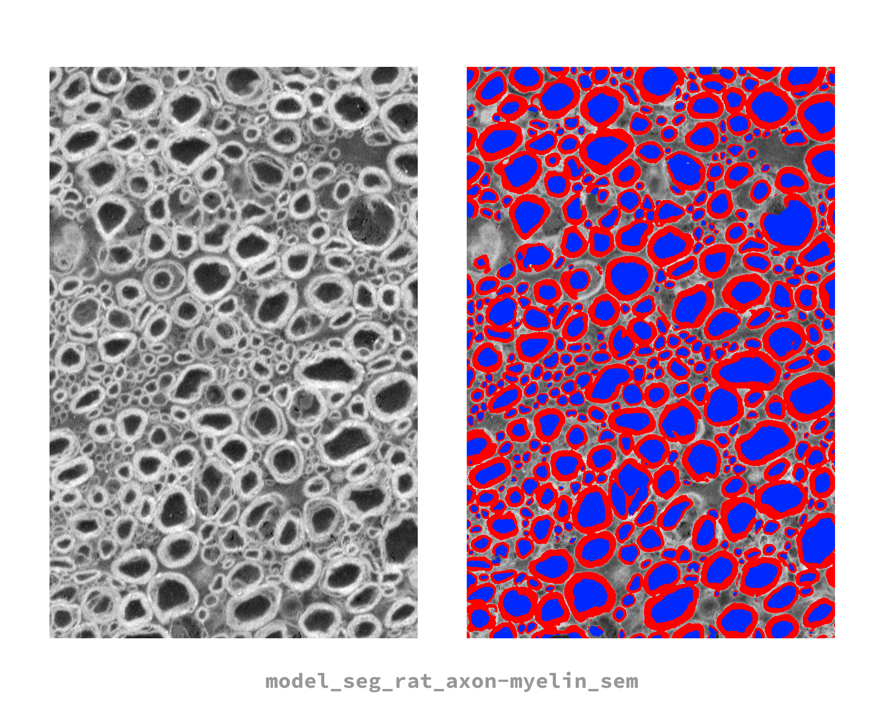

# model_seg_rat_axon-myelin_sem
---

## Model overview


AxonDeepSeg default SEM model and testing image. This model works at a resolution of 0.1 micrometer per pixel and was trained on rat spinal cord data collected via a Scanning Electron Microscope (SEM).

## Segment (ADS)
To segment an image using this model, use the following command in an `axondeepseg` virtual environment:
```
axondeepseg -t SEM -i <IMG_PATH> -s <PIXEL_SIZE>
```
The `-m` option can be omitted in this case because this is a default built-in model.

## Train and test (ivadomed)
This model was trained and tested with [ivadomed](https://ivadomed.org). We recommend you install ivadomed in a virtual environment to reproduce the original training steps. The specific revision hash of the version used for training is documented in the *version_info.log* file.

### Clone this repository
You will need the *model_seg_rat_axon-myelin_sem.json* configuration file located in this repo.
```
git clone https://github.com/axondeepseg/default-SEM-model
```

### Get the data
The SEM dataset used to train this model is hosted on GitHub [here](https://github.com/axondeepseg/data_axondeepseg_sem). The specific dataset revision hash used for training is documented in the *version_info.log* file.

### Train this model
To train the model, please first update the following fields in the aforementioned JSON configuration file:
- `gpu_ids`: specific to your hardware
- `path_output`: where the model will be saved
- `loader_parameters:path_data`: path to training data
- `loader_parameters:bids_config`: path to the custom bids config located in `ivadomed/config/config_bids.json`
- `split_dataset:fname_split`: path to the split_dataset.joblib file

Then, you can train the model with
```
ivadomed --train -c path/to/model_seg_rat_axon-myelin_sem.json
```
The trained model file will be saved under the `path_output` directory. For more information about training models in `ivadomed`, please refer to the following [tutorial](https://ivadomed.org/tutorials/two_class_microscopy_seg_2d_unet.html).

### Evaluate this model
To test the performance of this model, use
```
ivadomed --test -c path_to_config_file.json
```
The evaluation results will be saved in `"path_output"/results_eval/evaluation_3Dmetrics.csv`


## Train and test with nnUNetv2

### Structure of the `nn_unet_scripts` Directory

This directory contains the following components:

- **Conversion Script**: This script is responsible for converting the Touching Myelin Boundary Detection Dataset from the BIDS format to the format expected by nnUNetv2. To run execute the following command: 
```bash
python scripts/convert_from_bids_to_nnunetv2_format.py <PATH/TO/ORIGINAL/DATASET> --TARGETDIR <PATH/TO/NEW/DATASET>
```
- **Train Test Split File**: This file is a JSON file that contains the training and testing split for the dataset. It is used by the conversion script above. The file should be named `train_test_split.json` and placed in the same directory as the dataset.


### Getting Started

To set up the environment and run the scripts, follow these steps:

1. Create a new conda environment:
```bash
conda create --name sem_seg
```
2. Activate the environment:
```bash
conda activate sem_seg
```
3. Install PyTorch, torchvision, and torchaudio. For NeuroPoly lab members using the GPU servers, use the following command:
```bash
conda install pytorch torchvision torchaudio pytorch-cuda=12.1 -c pytorch -c nvidia
```
For others, please refer to the PyTorch installation guide at https://pytorch.org/get-started/locally/ to get the appropriate command for your system.
4. Update the environment with the remaining dependencies:
```bash
conda env update --file environment.yaml
```
5. Run the conversion script (the default target directory is the current working directory):
```bash
export RESULTS_DIR="<PATH/TO/SAVE/RESULTS>"
```
6. Set up the necessary environment variables:
```bash
python scripts/convert_from_bids_to_nnunetv2_format.py <PATH/TO/ORIGINAL/DATASET> --TARGETDIR $RESULTS_DIR
```
7. Set up the necessary environment variables:
```bash
export nnUNet_raw="$RESULTS_DIR/nnUNet_raw"
export nnUNet_preprocessed="$RESULTS_DIR/nnUNet_preprocessed"
export nnUNet_results="$RESULTS_DIR/nnUNet_results"
```
8. Run the nnUNet preprocessing command:
```bash
nnUNetv2_plan_and_preprocess -d 1 --verify_dataset_integrity
```